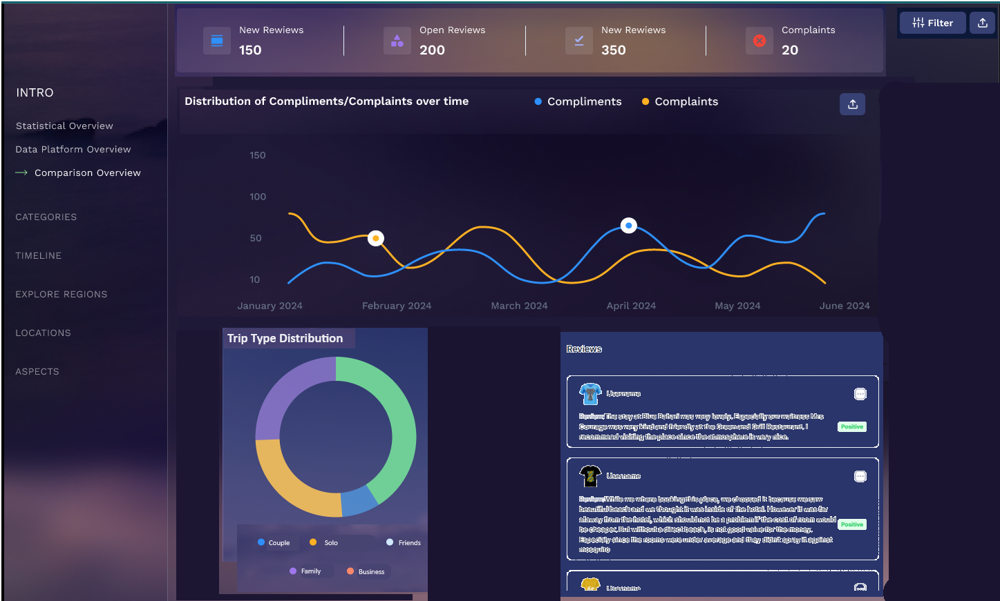

# Full-Stack Developer Task

## AI for Tourism Dashboard Page

This project is part of a full-stack development assignment focused on creating an interactive AI-powered Tourism Dashboard Page using React. The task involves visualizing and analyzing scraped data from two review platforms to gain insights into tourism trends. The dataset, located in the `full_stack_data.csv` file, will serve as the foundation for building various components such as charts and tables.

### Key Features:
1- **Data Statistics** : Display essential statistics about the dataset at the top of the page.
2- **Sidebar Navigation** : Include a left-hand sidebar for easy navigation throughout the dashboard.
